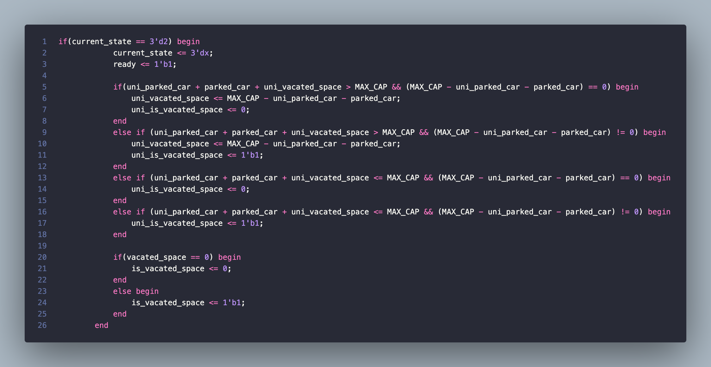

# کنترلر درب پارکینگ 
این پروژه به صورت خاص به طراحی  شبیه سازی درب پارکینگ یک دانشگاه می‌پردازد، که با استفاده از آن ورود و خروج و ظرفیت پارکینگ در ساعات گوناگون مدیریت و کنترل می‌شود. برای طراحی این پروژه از زبان توصیف سخت افزار verilog  استفاده شده است و در انتهای برنامه با استفاده از ابزار سنتز quartus در مورد بیشترین فرکانس تحقیق و بررسی شده است.

## ابزارها
در این پروژه همانطور که پیش تر ذکر شد از یک زبان توصیف سخت افزار و یک کامپایلر open source جهت کامپایل کردن آن زبان و یک ابزار سنتز جهت ستنز کردن کد مورد نظر بر روی یک FPGA  دلخواه استفاده شده است. ابزارهای‌ ذکر شده به شرح زیر می‌باشند:
- Verilog (زبان توصیف سخت افزار)
- IVerilog (کامپایلر رایگان جهت کامپایل کردن verilog)
- Quartus (ابزاری جهت ستنز کد برای FPGA دلخواه)

## جزئیات پیاده سازی
در این بخش به توضیح مختصری در رابطه با نحوه‌ی کار کرد کد پرداخته می‌شود توضیحات ریزتر در این رابطه در داک قابل مشاهده و بررسی می‌باشند.
مطابق خواسته‌ی سوال ظرفیت پارکینگ از ساعت ۸ تا ۱۳ برای ورود آزاد ۲۵۰ نفر است. در ساعت ۱۴، ۳۰۰ نفر در ساعت ۱۵، ۳۵۰ نفر و در ساعت ۱۶ برابر ۵۰۰ نفر است و این مقدار ظرفیت برای ورود آزاد تا ساعت ۸ صبح فردا نیز یکسان می‌ماند. همچنین ظرفیت ورود برای دانشگاه همواره ثابت بود و برابر ۵۰۰ نفر است.
در نمونه‌ی طراحی شده ظرفیت‌ها به صورت شناور تغییر می‌کنند و در همه‌ی موارد اولویت با ورود دانشگاه است.
برای اینکه در این کد تمام حالات ممکن پوشش داده شود و ظرفیت به صورت شناور با توجه به زمان و ظرفیت قبلی تغییر کند این کد در چند کلاک طراحی شده است و زمانی که اجرای کد به پایان می‌رسد سیگنال ready  در آن برابر یک می‌شود که نشان دهنده‌ی پایان ورود یا خروج یک ماشین از پارکینگ می‌باشد.
در ادامه به صورت مختصر به توضیح state های مختلف پرداخته می‌شود:
### حالت x
در این حالت مقدار ظرفیت با توجه به زمان ورودی برای ماشین‌ها دانشگاه و آزاد به روز می‌شود.

### حالت صفرم
در این حالت چنانچه flag مربوطه به مقداردهی برابر یک بود عملیات مقدار دهی صورت می‌گیرد در غیر این صورت مقدار ظرفیت برای دو گروه ماشین به روز می‌شود.
اگر در این حالت مقدار دهی رخ دهد وارد حالت اول می‌شویم در غیر این صورت به حالت سوم می‌رویم.

### حالت اول
در این حالت ادامه‌ی مرحله‌ی مقدار دهی انجام می‌شود و ظرفیت‌ها برای ماشین‌های آزاد به روز می‌شود.

### حالت دوم
در این بخش مرحله‌ی پایانی یعنی مقداردهی ماشین‌های دانشگاهی انجام گرفته و flag های وضعیت با توجه به ظرفیت‌ها مقداردهی می‌شوند.

### حالت سوم
در این بخش که در ادامه‌ی ورود و خروج عادی به پارکینگ می‌باشد خروج ماشین مورد بررسی قرار می‌گیرد و بر اساس آن وضعیت‌ها و ظرفیت‌ها به روز می‌شود.

### حالت چهارم
در این بخش ورود ماشین مورد بررسی قرار می‌گیرد. این سیستم قابلیت هندل کردن ورود و خروج همزمان ماشین‌ها را داراست و از این لحاظ مانعی ندارد.

### حالت پنجم
دراین حالت مقدار پرچم‌ها و ظرفیت‌ها بعد از آخرین تغییر مجددا به روز می‌شود و سیگنال ready پس از آن فعال می‌شود که به معنای آماده بودن خروجی می‌باشد.

نکته: حداکثر تعداد کلاک در این حالت برابر ۵ است که برای مقداردهی اولیه باشد که عملا یک دستور فرضی جهت کمک به بررسی و تست‌ حالات بیشتر می‌باشد. پس می‌توان گفت بیشترین کلاک در اجرای این برنامه ۴ عدد است که مربوط به ورود و خروج ماشین می‌شود.

## نحوه‌ی اجرا و تست نوشتن
برای اجرای این برنامه کافی است وارد برنامه‌ی مدل سیم شده و بر روی run و compile کلیک کرد، البته همین طور که در این جا نیز معرفی شده می‌توان با iverilog نیز این کار را صورت داد و کد را تولید نمود اما طبیعتا امکانات کد خروجی از modelsim کمتر خواهد بود.
برای تست نوشتن نیز کافی است به یک سری موارد توجه کنیم برای نمونه برای نمونه ما سیگنال‌های car_entered, is_uni_car_entered, car_exited, is_uni_car_exited, in_out_time, clk, init, init_uni_car, init_car,
                    uni_parked_car, parked_car, uni_vacated_space, vacated_space, uni_is_vacated_space, is_vacated_space, ready را داریم که برخی از آنها به صورت خروجی و برخی از آنها به مطابق صورت سوال به عنوان ورودی عمل می‌کنند برای این منظور ما در هر تست فقط قادر به تغییر ورودی‌ها خواهیم بود.

همانطور که در بالا نیز دیده  می‌شود با تعریف ماژول مرتبط و تغییر ورودی‌ها می‌توان تست جدید تولید کرد از آن جا که ورودی‌ها به صورت deep switch طراحی شده‌اند هنگامی یک سیگنال در این جا برابر یک می‌گردد در همه‌ی کلاک‌ها مورد بررسی قرار می‌گیرد.

## خروجی‌
در تست‌ها سعی شده است یک تست که تقریبا حالا متفاوت را نشان می‌دهد مطابق عکس بخش گذشته نوشته شود و خروجی آن نیز به صورت زیر است.

همانطور در خروجی دیده می‌شود زمان‌هایی که سیگنال ready برابر یک می‌شود جواب مورد نظر حاضر است و تمامی ‌مقادیر در آن لحظه به روز شده است.
## نویسنده
- [Mohammd Hossein Boroumandnia - 401170531](https://github.com/M-H-Boroumandnia)
